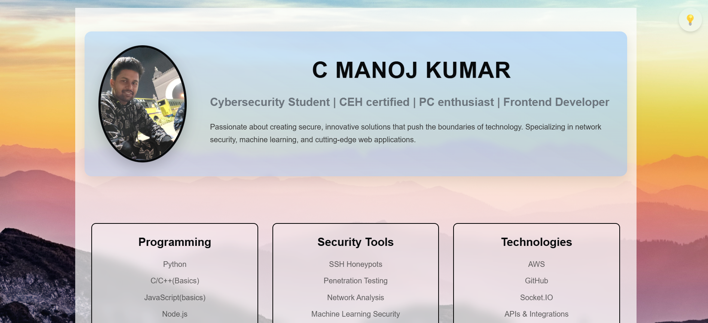
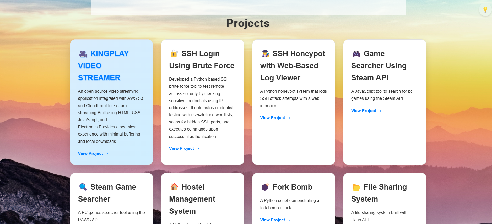

# portfolio_demo_ver

🚀 **Live Demo:** [portfolio_demo_ver](https://kingslayer458.github.io/portfolio_demo_ver/)


# 🚀 Personal Portfolio Website

A modern, responsive personal portfolio website showcasing my projects and skills as a cybersecurity professional and frontend developer.



## ✨ Features

- **Responsive Design** - Looks great on all devices from mobile to desktop
- **Dark/Light Mode Toggle** - Switch between themes with a smooth transition
- **Animated UI Elements** - Engaging animations for better user experience
- **Project Showcase** - Grid layout with hover effects for project cards
- **Skills Overview** - Clean section highlighting technical expertise
- **Modern Glass Morphism** - Subtle transparency effects for a contemporary look


## 💻 Technologies Used

- **HTML5** - Semantic markup structure
- **CSS3** - Advanced styling with animations and transitions
- **JavaScript** - Interactive elements and theme toggling


## 🚀 Getting Started

1. Clone the repository
   ```
   git clone https://github.com/yourusername/personal-portfolio.git
   ```

2. Open `index.html` in your browser

3. To modify:
   - Edit HTML to update content
   - Modify CSS for styling changes
   - Update JavaScript for behavior adjustments

---

Made by C MANOJ KUMAR
